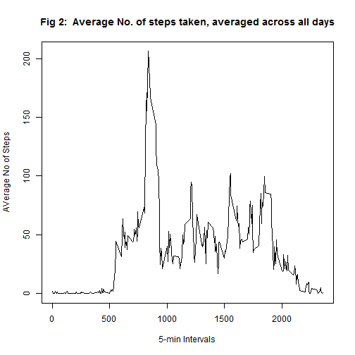

#Reproducible Research - Peer Assessment 1
##Introduction
Personal movement data are collected using device such as Fitbit, Nike Fuelband, or Jawbone Up. This assignment makes use of data from a personal activity monitoring device. A device collected data at 5 minute intervals through out the day. The data consists of two months of data from an anonymous individual collected during the months of October and November, 2012 and include the number of steps taken in 5 minute intervals each day.

##Data Loading  and Pre-Processing
Data were downloaded from the course web site. The data provided is in a csv format. There are three columns: the number of steps, the date and a label for the 5 minute interval. Missing values in steps where coded as NA and dates were coded in the 'YYYY-MM-DD' format. 


```r
# Load provided data (use relative paths)
activity <- read.csv(file = './activity.csv', stringsAsFactors = FALSE)
# Change Date variable from character to date
activity$date <- as.Date(activity$date)
#Remove incomplete cases
data <- subset(activity,complete.cases(activity))
```

#Mean total number of steps taken per day
A histogram is plotted as figure 1 below to show the distribution of the total number of steps taken per day. A quick summary shows that the daily total number of steps have a mean of 10766.19 and a median of 10765 steps.


```r
#Plot Histogram as Figure 1.
library(ggplot2)
hist <- qplot(x= date, y=steps, stat='summary',data = data, fun.y=sum, geom='bar' ) +   labs(title='Fig 1: Total No. of steps taken daily\n',
       y='Total steps per day', x='Period')
###############################################################################
#Summarize daily date by mean and median
period <- unique(data$date)
dailytotal <- NULL #declare dailytotal
for (i in 1:length(period)){
  dailydata<-subset(data,data$date == period[i])
  dailytotal[i] <- sum(dailydata[,1])
}
mean(dailytotal)
```

```
## [1] 10766
```

```r
median(dailytotal)
```

```
## [1] 10765
```

```r
print(hist)
```

 

#Average Daily Activity Pattern
A time series plot in figure 2 shows the average number of steps taken daily, averaged across all days. The 5-minutes interval "835" contains the highest number of steps at 10,927 steps.

```r
intervals <- unique(activity$interval)
ttl_step_int<-NULL
mean_step_int <- NULL
for (i in 1:length(intervals)){
  int_data <- subset(data,data$interval== intervals[i])
  ttl_step_int <- rbind(ttl_step_int,cbind(intervals[i],sum(int_data[,1])))
  mean_step_int <- rbind(mean_step_int,cbind(intervals[i],mean(int_data[,1])))
  }
ttl_step_int<-data.frame(ttl_step_int)
mean_step_int<-data.frame(mean_step_int)
names(ttl_step_int) <- c("Interval","Steps")
names(mean_step_int) <- c("Interval","Steps")
#Identify interval with highest no of steps
highest.int<-ttl_step_int[ttl_step_int$Steps==max(ttl_step_int$Steps),]
highest.int
```

```
##     Interval Steps
## 104      835 10927
```

```r
#Plot Time series with plot(type='l')
plot(x=mean_step_int$Interval,y=mean_step_int$Steps,type = 'l',xlab = "5-min Intervals",ylab = "AVerage No of Steps", main = "Fig 2:  Average No. of steps taken, averaged across all days")
```

 

#Missing Values
There are 2304 number of missing values. These missing values are replaced by the mean of the number of steps for that interval across the dates. A new dataset (activity_filled) were created with the missing values replaced by the interval mean. A histogram is plotted in figure 3 showing the number of steps taken each day with the missing values filled in. 


```r
#Find total NAs
total_missings <- sum(!complete.cases(activity))
total_missings
```

```
## [1] 2304
```

```r
#Fill in missing values with interval means
activity_filled <-activity
for (i in 1:length(activity_filled[,1])){
  if (is.na(activity_filled[i,1]==TRUE)){
    activity_filled[i,1] <- round(mean_step_int[mean_step_int$Interval== activity[i,3],2],0)
    }
  }
#Plot histogram
hist2 <- qplot(x= date, y=steps, stat='summary',data = activity_filled, fun.y=sum, geom='bar' ) +   labs(title='Fig 3: Total No. of steps taken daily, after imputing missing values\n',
       y='Total steps per day', x='Period')
print(hist2)
```

 
After filling in the missing data with the interval mean, the number of steps taken daily have a mean of 10765.64 while the median is 10762. The difference is only 0.549 and 3 respectively. Hence, this show that the missing data is unlikely to make a big difference.


```r
#Summarize daily date by mean and median
period2 <- unique(activity_filled$date)
dailytotal2 <- NULL #declare dailytotal2
for (i in 1:length(period2)){
  dailydata2<-subset(activity_filled,activity_filled$date == period2[i])
  dailytotal2[i] <- sum(dailydata2[,1])
}
mean(dailytotal2)
```

```
## [1] 10766
```

```r
median(dailytotal2)
```

```
## [1] 10762
```

```r
mean(dailytotal)-mean(dailytotal2)
```

```
## [1] 0.5493
```

```r
median(dailytotal)-median(dailytotal2)
```

```
## [1] 3
```

#Differences in Activity Patterns between Weekdays and Weekends
weekdays() function is used to assign the "weekday" and "weekend" levels. The data is separated by weekdays and weekends. The average number of steps is computed respectively and plotted against the intervals. The plot for weekdays can be seen in figure 4 while the plot for weekends can be seen in figure 5.

```r
days <- as.character(weekdays(data$date))
weekend <-rep("weekday",length(days))
for (i in 1:length(days)){
  if(days[i]=="Saturday" | days[i]=="Sunday"){
    weekend[i]="weekend"
  }
}
data <- data.frame(cbind(data,weekend))
data_wkday <- subset(data,data$weekend=="weekend")
data_wkend<- subset(data,data$weekend=="weekday")
mean_step_int_day = NULL
mean_step_int_end = NULL

for (i in 1:length(intervals)){
  int_data_day <- subset(data_wkday ,data_wkday $interval== intervals[i])
  int_data_end <- subset(data_wkend ,data_wkend $interval== intervals[i])
  mean_step_int_day <- rbind(mean_step_int_day,cbind(intervals[i],mean(int_data_day[,1])))
  mean_step_int_end <- rbind(mean_step_int_end,cbind(intervals[i],mean(int_data_end[,1])))
  }
mean_step_int_day<-data.frame(mean_step_int_day)
mean_step_int_end<-data.frame(mean_step_int_end)
names(mean_step_int_day) <- c("Interval","Steps")
names(mean_step_int_end) <- c("Interval","Steps")
#set to 2 row grid
par(mfrow=c(2,1))
#Plot Time series with plot(type='l')
plot(x=mean_step_int_day$Interval,y=mean_step_int_day$Steps,type = 'l',xlab = "5-min Intervals",ylab = "AVerage No of Steps", main = "Fig 4:  Average No. of steps taken, \n averaged across all days, for weekdays")
plot(x=mean_step_int_end$Interval,y=mean_step_int_end$Steps,type = 'l',xlab = "5-min Intervals",ylab = "AVerage No of Steps", main = "Fig 5:  Average No. of steps taken, \n averaged across all days, for weekends")
```

 

